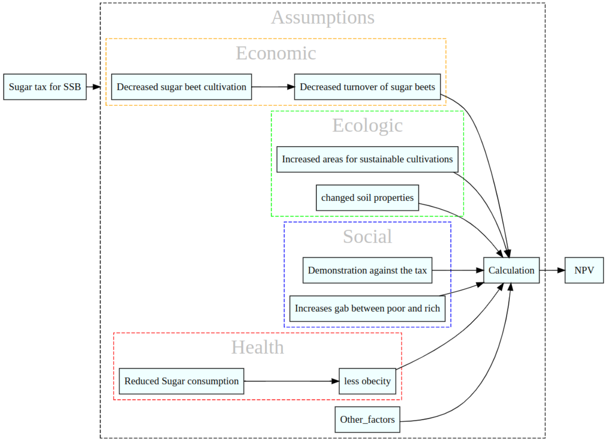
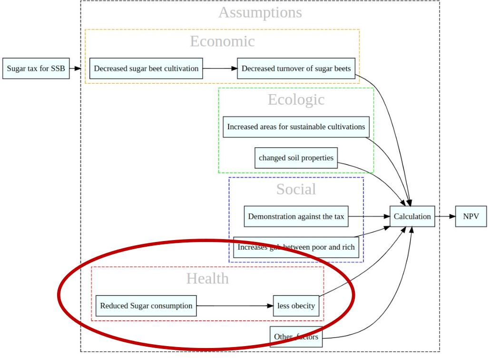
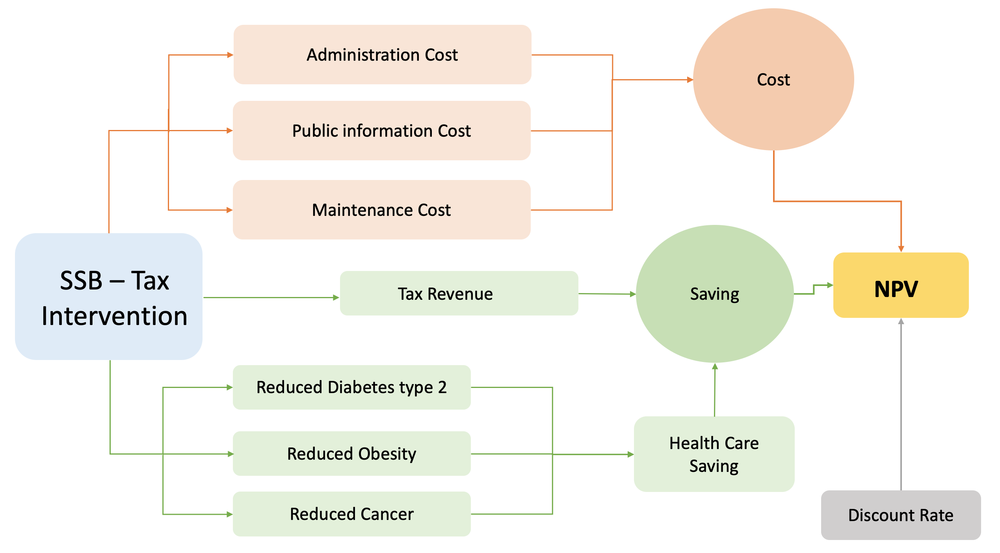
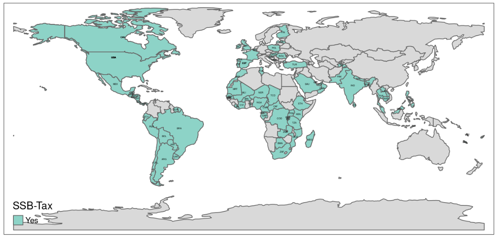
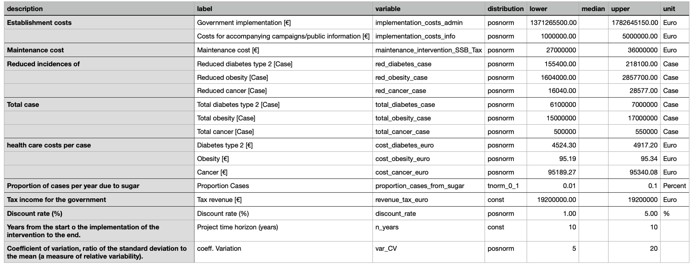

<!-- LOADING DATA -->
```{r, include = F}
model_first_clean   <- 
model_first         <- 
model_last          <- 
taxmap              <- 
input_table         <-  

#packages for decision
knitr::write_bib(c(.packages(),
                   'decisionSupport', 'tmap', 'readxl'),'bib/project_packages.bib')

```


## Introduction

### What are Sugar-Sweetened Beverages (SSBs)?
* soft drinks, energy drinks, fruit nectar drinks etc.
* one of the main sources of added sugar intake in Germany
* many associated health issues, that lead to a decrease in life quality of individual people and are also a burden on the public health system ([@WHO2022 & @Backholer2022])

### And why should they be taxed?
* to internalize the external costs of high sugar consumption for the society
* higher prices of SSBs lead to lower consumption: proven for several countries
  + a 10% tax has been shown to lead to an 8-10% reduction in purchase and consumption of SSBs
  + a 20% tax has been demonstrated to reduce the prevalence of overweight by 1-3% and the prevalence of obesity by 1-4%
  + SSB taxes can significantly reduce the incidence of other health issues like diabetes type 2
  + SSB taxes have resulted in substantial increases in government revenue
  + no evidence of negative impact on employment was found (@Backholer2022)
* tax returns can be reinvested in health sector, further promoting health and well-being of the population
* alternative interventions to reduce sugar consumption on the individual and producer/retailer level often show effects slower and are more costly; they are still useful to accompany a tax introduction 
* WHO and UNICEF recommend the introduction of a SSB tax ([@WHO2022 & @Backholer2022])


### Why did we choose Germany?
* Germany doesn’t have this kind of tax at the moment
* officially because “there is not enough scientifical evidence yet that a tax on SBBs will decrease sugar or total energy intake of the population in the long term and/or decrease obesity”  [@DeutscherBundestag2020]

* Instead, Germany has a national strategy ([NRI, 2019-25](https://www.bmel.de/SharedDocs/FAQs/DE/faq-reduktionsstrategieZuckerSalzFette/FAQ-reduktionsstrategieZuckerSalzFette_List.html)) including the reduction of sugar contents of heavily processed food/drinks and awareness raising campaigns  


<center>
```{r echo=FALSE}
library(tmap)
data("World")
library(readxl)
SSB_Tax_Database_Feb23 <- read_excel("SSB-Tax-Database-Feb23.xlsx")

SSB_World <- merge(World, SSB_Tax_Database_Feb23, by.x="iso_a3", by.y="wb_code")

tm_shape(World)+
  tm_polygons()+
  tm_shape(SSB_World)+
  tm_polygons("SSB-Tax")+
  tm_layout(main.title = "Countries with SSB -Tax",
            main.title.position = "center",
            main.title.color = "lightblue")+
  tm_text(text = "iso_a3", size = 0.2)
```

</center>
The data is according to FAOSTAT 2023.

For visualization, we used the package 'tmap' [@R-tmap].


## Decision 

**Decision:** Introducing a tax on SSBs in Germany

**Decision maker:** German government

### Underlying assumptions of the model
* higher prices lead to lower consumption of SSBs
  + important to declare the tax separately on the label and explain about negative health consequences to make the tax more effective
  + awareness raising campaigns and public information also important
  + some people might feel patronized and consume even more
* lower consumption of SSBs leads to lower consumption of sugar
  + people might substitute with other sugar-rich products


## Model: Broad approach
In our overall decision model, we are looking at all the possible effects that come from implementing a tax on SSBs. These include economic, ecologic, social and health factors.
From an economic point of view, the implementation of an SSB tax might decrease earnings of stakeholders along the value chain of SSB production and sale. This starts with sugar beet cultivators, who might have to abandon sugar beet production or at least reduce it.
From an ecological perspective, reduced sugar beet cultivation might free space for more sustainable cultivation of other crops or biodiversity conservation measures. It might increase soil health, as the cultivation of sugar beets, especially over a long period of time, was found to be deleterious to the soil. 
Finally, considering the social aspect, an SSB tax could lead to demonstrations by people who feel patronized by it. There is also the question if an artificial price rise is ethically justifyable or if this is a discrimination of poorer households.


<center>
```{r, echo=FALSE}
model_first_clean
```
</center>

To decrease complexity and develop a comprehensive decision model, we focus on the effects that an SSB tax might have on health outcomes. We assume that higher prices of SSBs lead to lower consumption and therefore reduced sugar intake, leading to fewer cases of sugar consumption related health issues like diabetes, obesity and cancer.  


## Model: Health Care Cost
The german government will make the decision of introducing a SSB tax if this will save them expenses. For our model, we are simulating the effects of a tax over a 10 year period.
Costs of a tax for the government encompass administration costs and costs for public information and awareness raising campaigns for the first year. For each consecutive year, there will be maintenance costs.
Savings in expenses for the government will come from reduced incidences of diabetes, obesity and cancer and the related saved spendings on treatments.
Furthermore, there will be tax revenues.  

<center>
```{r, echo=FALSE}
model_last

```
</center>
At the end, the total NPV will be calculated based on these costs and benefits which will help us to decide whether to implement a SSB tax or not. 


## Input table
```{r}

input_table

```

[@Du2021, @Sanchez-Romero2016, @Lal2017]

## Calculation
```{r}
library(decisionSupport)

decision_function <- function(x, varnames){
  # total health care cost related to sugar consumption: type 2 diabetes, cancer and obesity 
  # proportion_cases_from_sugar is assumption of relation between sugar consumption and disease 
  
  cost_diabetes <-vv(total_diabetes_case*proportion_cases_from_sugar, var_CV, n_years)*
    vv(cost_diabetes_euro, var_CV, n_years)
  
  cost_obesities <- vv(total_obesity_case*proportion_cases_from_sugar, var_CV, n_years)*
    vv(cost_obesity_euro, var_CV, n_years)
  
  cost_cancer <- vv(total_cancer_case*proportion_cases_from_sugar, var_CV, n_years)*
    vv(cost_cancer_euro, var_CV, n_years)
  
  total_health_care_cost <- cost_diabetes + cost_obesities + cost_cancer
  
  # pre-calculate common random draws for all intervention model runs ####
  #health care cost after implementation of tax and Tax revenue 
  
  precalc_HC_with_interv_Tax_DI <- (vv(total_diabetes_case*proportion_cases_from_sugar, var_CV, n_years)*
                                      vv(cost_diabetes_euro, var_CV, n_years)) - 
    (vv(red_diabetes_case*proportion_cases_from_sugar, var_CV, n_years)* vv(cost_diabetes_euro, var_CV, n_years))
  
  precalc_HC_with_interv_Tax_OB <-  (vv(total_obesity_case*proportion_cases_from_sugar, var_CV, n_years)*
                                       vv(cost_obesity_euro, var_CV, n_years))-
    (vv(red_obesity_case*proportion_cases_from_sugar, var_CV, n_years)*vv(cost_obesity_euro, var_CV, n_years))
  
  precalc_HC_with_interv_Tax_CA <- (vv(total_cancer_case*proportion_cases_from_sugar, var_CV, n_years)*
                                      vv(cost_cancer_euro, var_CV, n_years))- 
    (vv(red_cancer_case*proportion_cases_from_sugar, var_CV, n_years)*vv(cost_cancer_euro, var_CV, n_years))
  
  precalc_tax_revenue <- vv(revenue_tax_euro, var_CV, n_years)
  
  
  ###Intervention of implementation SSB Tax ###
  
  for (decision_implementation_SSB_Tax in c(FALSE,TRUE)){
    
    if (decision_implementation_SSB_Tax){
      
      implementation_SSB_Tax <- TRUE
      implementation_admin <- TRUE
      no_implementation <- FALSE
      
    } else
    {
      implementation_SSB_Tax <- FALSE
      implementation_admin <- FALSE
      no_implementation <- TRUE
      
    }
    
    
    ##cost for intervention##
    if (implementation_admin){
      cost_implementation_govern <-
        implementation_costs_admin + implementation_costs_info
    } else{
      cost_implementation_govern <- 0
    }
    
    # calculating the maintenance costs, initializing the array with 0 costs for the first year:
    maintenance_cost <- rep(0, n_years)
    
    if (implementation_SSB_Tax){
      maintenance_cost <-
        maintenance_cost + vv(maintenance_intervention_SSB_Tax, 
                              var_CV, n_years)
      
      intervention_cost <- maintenance_cost
      
      #intervention cost for first year 
      intervention_cost[1] <-
        cost_implementation_govern 
    }
    
    
    # health care cost after SSB Tax  ####
    
    implementation_SSB_Tax_Di <- 
      as.numeric(implementation_SSB_Tax) * precalc_HC_with_interv_Tax_DI
    implementation_SSB_Tax_OB <-
      as.numeric(implementation_SSB_Tax) * precalc_HC_with_interv_Tax_OB
    implementation_SSB_Tax_Ca <- 
      as.numeric(implementation_SSB_Tax) * precalc_HC_with_interv_Tax_CA
    
    
    total_healthcare_cost_with_SSB_Tax <-
      implementation_SSB_Tax_Di + implementation_SSB_Tax_OB + implementation_SSB_Tax_Ca
    
    implementation_SSB_Tax_tax_revenue <- 
      as.numeric(implementation_SSB_Tax) * precalc_tax_revenue
    
    #Health care cost without SSB Tax   
    
    cost_diabetes_no_SSB_Tax <-  as.numeric(no_implementation)*cost_diabetes
    
    cost_obesities_no_SSB_Tax <- as.numeric(no_implementation)* cost_obesities
    
    cost_cancer_no_SSB_Tax <- as.numeric(no_implementation)*cost_cancer
    
    total_health_care_cost_no_SSB_Tax <- 
      cost_diabetes_no_SSB_Tax + cost_obesities_no_SSB_Tax + cost_cancer_no_SSB_Tax
    
    
    if(implementation_SSB_Tax){
      imple_tax_revenue <- implementation_SSB_Tax_tax_revenue
    } else imple_tax_revenue <- 0
    
    
    ## Total cost with SSB tax##
    if (decision_implementation_SSB_Tax){
      
      net_health_care_cost_with_imple <-  
        total_healthcare_cost_with_SSB_Tax + intervention_cost - implementation_SSB_Tax_tax_revenue
      
      
      result_imple <- net_health_care_cost_with_imple
    }
    
    if (!decision_implementation_SSB_Tax){
      result_no_imple <- total_health_care_cost_no_SSB_Tax 
    }
    
  }#close implementation
  
  #calculate NPV 
  
  NPV_imple <-
    discount(result_imple, discount_rate, calculate_NPV = T)
  
  NPV_no_imple <-
    discount(result_no_imple, discount_rate, calculate_NPV = T)
  
  
  
  return(list(Imple_NPV =  - NPV_imple, #invert because this is the spending
              NO_Imple_NPV = - NPV_no_imple, #invert because this is the spending
              NPV_decision_SSB_Tax =  NPV_no_imple - NPV_imple, #how much they will save
              Cashflow_decision_SSB_Tax =  result_no_imple - result_imple)) #how much they will save
}


```

## Simulation 

```{r}

library(readr)
input_table <- read.csv("input_table_updated_3.csv")


###Model assessment###
mcSimulation_results1 <- mcSimulation(estimate = 
                                        estimate_read_csv("input_table_updated_3.csv"),
                                      model_function = decision_function,
                                      numberOfModelRuns = 1000,
                                      functionSyntax = "plainNames"
)
```


## Plots: Net present Value

The graphs show the results of a Monte Carlo simulation based on our model and input data, where the expected net present value and the comparison show what the government would spend in each scenario. We cannot see significant differences here, as the distribution is very widely spread, indicating high uncertainties in our model.

<center>
```{r}

plot_distributions(mcSimulation_object = mcSimulation_results1, 
                   vars = c("Imple_NPV",
                            "NO_Imple_NPV"),
                   method = 'smooth_simple_overlay', 
                   base_size = 10)


decisionSupport::plot_distributions(mcSimulation_object = mcSimulation_results1, 
                                    vars = c("Imple_NPV",
                                             "NO_Imple_NPV"),
                                    method = 'boxplot')
```
</center>

If we zoom in and plot just the changes of how much money the government will safe on health care costs due to the tax, we see that they will safe money more often than they would not.
Still, we have a wide distribution due to uncertainty.

<center>
```{r}
decisionSupport::plot_distributions(mcSimulation_object = mcSimulation_results1, 
                                    vars = "NPV_decision_SSB_Tax",
                                    method = "smooth_simple_overlay",
                                    old_names = "NPV_decision_SSB_Tax",
                                    new_names = "Outcome distribution for savings")


```
</center>

## Cashflow analysis###

Here we plot the distribution of annual cashflow over a simulated 10-year period for the option of implementing the tax.
In the first two years roughly, the government will not have reductions in health care costs, because of the costs for implementing the SSB tax. But after two years, the government will start to save money on health care constantly.

<center>
```{r}

plot_cashflow(mcSimulation_object = mcSimulation_results1, 
              cashflow_var_name = "Cashflow_decision_SSB_Tax")

```
</center>


## Value of Information

The value of information analysis shows us if collecting more information on a certain input variable would provide more and how much certainty about the decision options. 
The expected value of perfect information (EVPI) shows how much money the decision maker would be willing to spend to get more information on one variable.
If we assume that 1-10% (see input table) of the disease cases per year are related to reduced sugar consumption, the government would be willing to pay around 200 Million Euro to get more  information about that.

<center>
```{r}
#here we subset the outputs from the mcSimulation function (y) by selecting the correct variables
# choose this carefully and be sure to run the multi_EVPI only on the variables that the you want
#EVPI = (EOL : Expected Opportunity Loss)


mcSimulation_table <- data.frame(mcSimulation_results1$x, mcSimulation_results1$y[1:3])

evpi <- multi_EVPI(mc = mcSimulation_table, first_out_var = "Imple_NPV")


plot_evpi(evpi, decision_vars = "NPV_decision_SSB_Tax")
```
</center>


## Plot of NPV, Cashflow and VoI

In the graph on the bottom left we determine the Variable Importance in the Projection (VIP) for our model variables.
At the X-axis value = 1, we see the threshold between important and unimportant variables for the model output.
We also see the importance of the proportion of disease cases per year related to sugar.


<center>
```{r}

#put here mcSimulation_result instead of pls_result
compound_figure(mcSimulation_object = mcSimulation_results1, 
                input_table = input_table, 
                plsrResults = mcSimulation_results1, 
                EVPIresults = evpi, decision_var_name = "NPV_decision_SSB_Tax", 
                cashflow_var_name = "Cashflow_decision_SSB_Tax", 
                base_size = 5)


```
</center>

## Projection to Latent Structures
<center>
```{r}


pls_result <- plsr.mcSimulation(object = mcSimulation_results1,
                                resultName = names(mcSimulation_results1$y)[3], ncomp = 1)
plot_pls(pls_result, input_table = input_table, threshold = 0)


```
</center>


## Conclusion

- We did not choose an easy decision
- Many underlying assumptions that are difficult to prove (causal effects)
- Complex calculations that need a lot of input data
- High uncertainties
- Much more research needed


To see all the data we used, please visit our [GitHub-Repository](https://github.com/SHMooon/nutrition)


## Sources