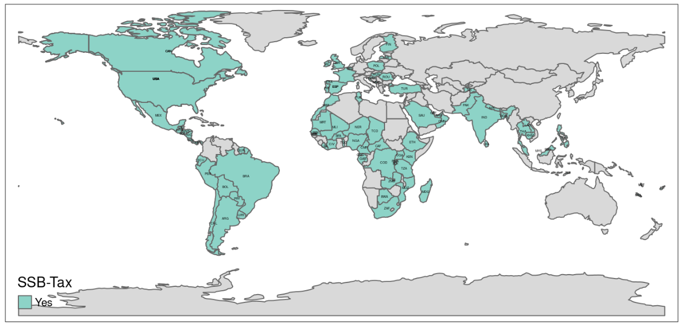

<!-- LOADING DATA -->
```{r, include = F}
model_first_clean   <- knitr::include_graphics('files/model_first_clean.png')
model_first         <- knitr::include_graphics('files/model_first.png')
model_last          <- knitr::include_graphics('files/model_last.png')
taxmap              <- 


```


## Introduction
<div>
```{r, echo=T}
library(tmap)
data("World")
library(readxl)
SSB_Tax_Database_Feb23 <- read_excel("SSB-Tax-Database-Feb23.xlsx")

SSB_World <- merge(World, SSB_Tax_Database_Feb23, by.x="iso_a3", 
                   by.y="wb_code")

tm_shape(World)+
  tm_polygons()+
  tm_shape(SSB_World)+
  tm_polygons("SSB-Tax")+
  tm_layout(main.title = "Countries with SSB -Tax",
            main.title.position = "center",
            main.title.color = "lightblue")+
  tm_text(text = "iso_a3", size = 0.2)
```
</div>

## Model with a broad approach

<center>
```{r, echo=FALSE}
model_first_clean
```
</center>


## Model for Decision Analysis
<center>
```{r, echo=FALSE}
model_last
```
</center>

## Calculation
```{r}
# insert code here 
```


## Plots
<center>
```{r}
# insert plots here 
```
</center>

## Sources
<!--Insert sources here --> 

To see all the data we used, please visit our [GitHub-Repository](https://github.com/SHMooon/nutrition)

