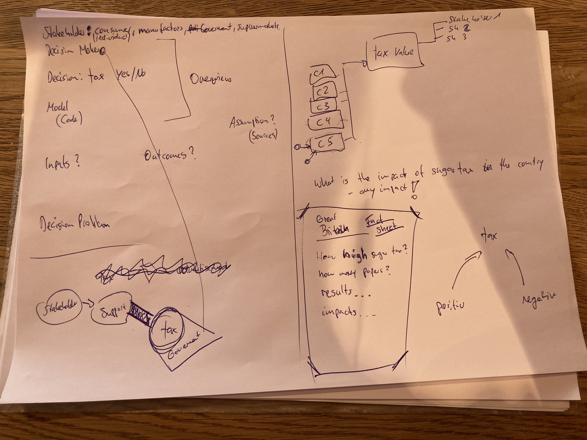

<!--please enter your names as authors--> 

```{r setup, include=FALSE}
knitr::opts_chunk$set(echo = TRUE)
# Description from https://www.reddit.com/r/RStudio/comments/g49gu0/r_markdown_knitropts_chunksetecho_true/
# Having knitr::opts_chunk$set(echo = TRUE) in a chunk at the beginning of your document is the same of having ````{r echo = TRUE}` for all chunks.
# You can also use it for setting other configs, like echo, eval, include and others 
```

## Inclution of our first steps (this header can be changed)

```{r, include=FALSE}
knitr::include_graphics('sup_data/230428_brainstorm1.JPG')
```


# Model with R
#### Model from Sanghyo (excluded)
```{r, include=FALSE}
#knitr::include_graphics('Sanghyo Mermaid.png')


#knitr::read_chunk('Sanghyo.R')

source('Sanghyo.R')
Sanghyo

```


#### Model from Patrick (exluded)
```{r, include=FALSE}

source('model_patrick.R')
model_patrick
```

<!--
# Building a decision
* **Research** 
    + Where exists sugar taxes already? 
    + for which products exist sugar taxes?
    + add more...

* **Positiv apsects** of a sugar tax:
    + less sugar consumption -> benefit on health 
    + add more... 

* **Negativ aspects** of a sugar tax:
    + higher cost for the consumer
    + add more... 
    
* **Further aspects** 
    + impacts on social relationships? e.g. kids birthday
    
-->

## Brainstorming 7th of June 2023 
```{r, include=T, echo=F}

```


